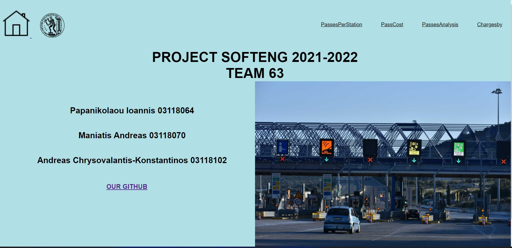

# Software Engineering ECE NTUA 2021-2022 :mask:
### Team Name  _TL21-63_
  

> A web app about interoperability in tolls highways with different automatic crossing systems

 Οδηγίες εγκατάστασης εφαρμογής 

1) Κάνoυμε `git clone https://github.com/ntua/TL21-63.git`
2) Εγκαθιστούμε (τοπικά) την [βάση](https://github.com/ntua/TL21-63/blob/master/database) μας
3) `cd backend` -> `npm install ` και έπειτα `nodemon index.js` 
4) `cd frontend` -> `npm install ` και έπειτα `nodemon index.js` 
5) `cd cli` -> `npm install ` ,`npm i -g` και τέλος `npm link`  
6) Επισκεπτόμαστε την ιστοσελίδα [localhost:5000](http://localhost:5000) ή ένα terminal  για εντολές cli.

 
### Technologies used

##### [Back-end](https://github.com/ntua/TL21-63/tree/master/backend)
* Node.js/npm
- Visual Studio Code

##### [Front-end](https://github.com/ntua/TL21-63/tree/master/frontend) (_Javascript_) 
* Node.js/npm/EJS
- Visual Studio Code

- - -
#### Team Members

| Name |  Εmail|
| --- | --- |
| Andreas Chrysovalantis-Konstantinos | *el18102@mail.ntua.gr* |
|  Maniatis Andreas  | *el18070@mail.ntua.gr* |
|  Papanikolaou Ioannis | *el18064@mail.ntua.gr* |
